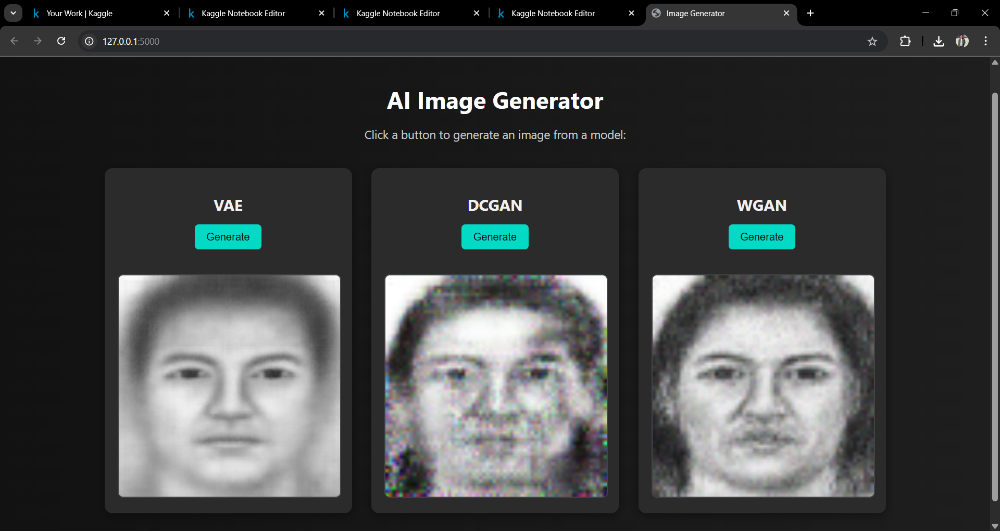

# 🧠 VAE, DCGAN & WGAN Image Generator

A Flask-based web application that allows users to generate synthetic hand shetched images using three popular generative models:

- **VAE** (Variational Autoencoder)
- **DCGAN** (Deep Convolutional Generative Adversarial Network)
- **WGAN** (Wasserstein GAN)

Built with PyTorch for the deep learning models and Flask for the backend, it features a modern UI where users can choose a model and instantly generate images.

---

## 🚀 Features

- 🔁 Choose between three pretrained models: VAE, DCGAN, and WGAN.
- 🧠 Models trained on synthetic image data.
- ⚡ Generate and view images instantly in the browser.

---

## 🛠️ Technologies Used

- **Backend:** Python, Flask
- **Frontend:** HTML, CSS (with Tailwind styling)
- **Deep Learning:** PyTorch, torchvision

---

## 📦 Project Structure

